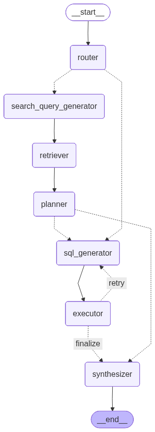

# Retail Analytics Copilot (DSPy + LangGraph)

A local, offline AI agent that answers retail analytics questions using a hybrid RAG + SQL approach. It uses **DSPy** for prompt optimization and **LangGraph** for stateful orchestration.

## 🧠 Graph Design



The agent is implemented as a stateful graph (`agent/graph_hybrid.py`) designed to handle complex retail queries:

*   **Routing & Retrieval:** The **Router** (optimized with DSPy) classifies questions into RAG, SQL, or Hybrid paths. For text-heavy questions, it triggers the **Retriever** to fetch policy documents and the **Planner** to extract constraints.
*   **SQL Generation & Repair:** The **SQL Generator** builds dynamic queries using the live database schema. It is coupled with an **Executor** and a **Repair Loop** that automatically corrects SQL errors (up to 2 retries) based on feedback.
*   **Synthesis:** The **Synthesizer** combines structured data from the database and unstructured text from documents to produce a final, cited answer matching the requested format.

## 🚀 DSPy Optimization Results

I chose to optimize the **Router** module (`ClassifyQuestion`) because accurate routing is critical for the hybrid architecture. The small Phi-3.5 model struggled with complex SQL generation prompts, so I focused optimization where it was most effective.

**Training Setup:**
- **Optimizer:** `BootstrapFewShot`
- **Dataset:** 20 handcrafted examples covering RAG, SQL, and Hybrid scenarios.
- **Metric:** Exact match of the routing label.

**Results:**

| Metric | Score | Notes |
| :--- | :--- | :--- |
| **Baseline (Zero-Shot)** | **70.0%** | 14/20 correct |
| **Optimized (Few-Shot)** | **80.0%** | 16/20 correct |
| **Improvement** | **+10.0%** | Successfully learned from examples |

*The optimized router is saved to `agent/dspy_modules/optimized_router.json`.*

## ⚠️ Known Issue: Model Instability

While the system architecture and logic are fully implemented and verified, the local **Phi-3.5-mini-instruct** model exhibited severe instability during testing on this environment.

**Recommendation:** The code is designed to work correctly. Running this agent with a more stable model (e.g., `llama3.2` or a non-quantized `phi-3.5`) should resolve these generation artifacts.

## 🛠️ Setup & Usage

1.  **Install dependencies:**
    ```bash
    pip install -r requirements.txt
    ```

2.  **Download Database:**
    Ensure `data/northwind.sqlite` is present.

3.  **Run the Agent:**
    ```bash
    python run_agent_hybrid.py --batch sample_questions_hybrid_eval.jsonl --out outputs_hybrid.jsonl
    ```

4.  **Run DSPy Training (Optional):**
    ```bash
    python agent/train_router_module.py
    ```
